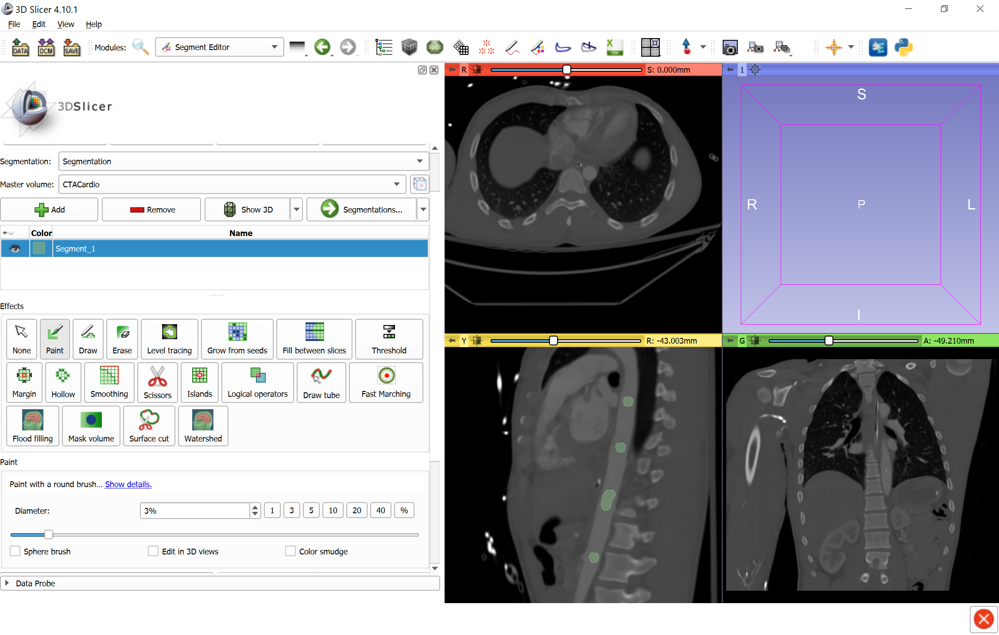
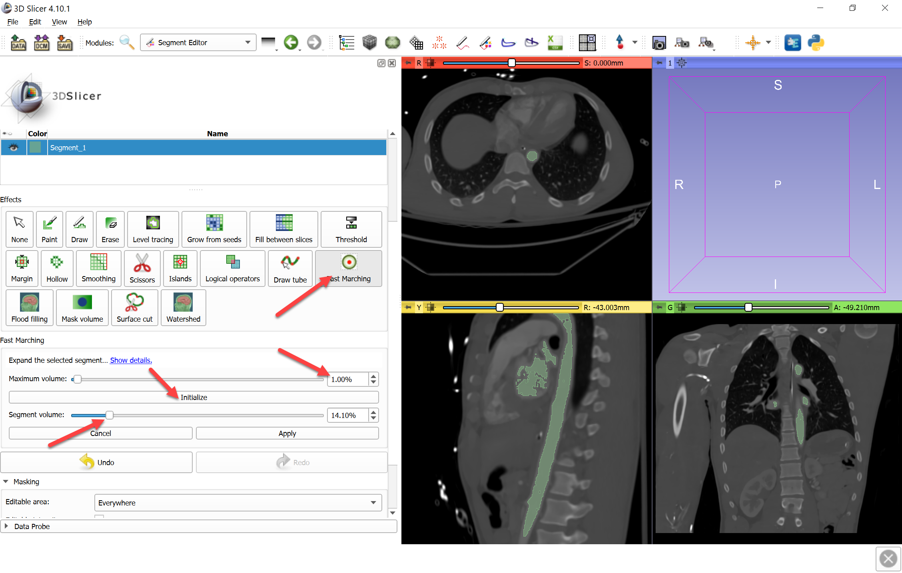
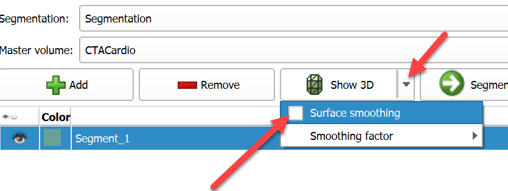
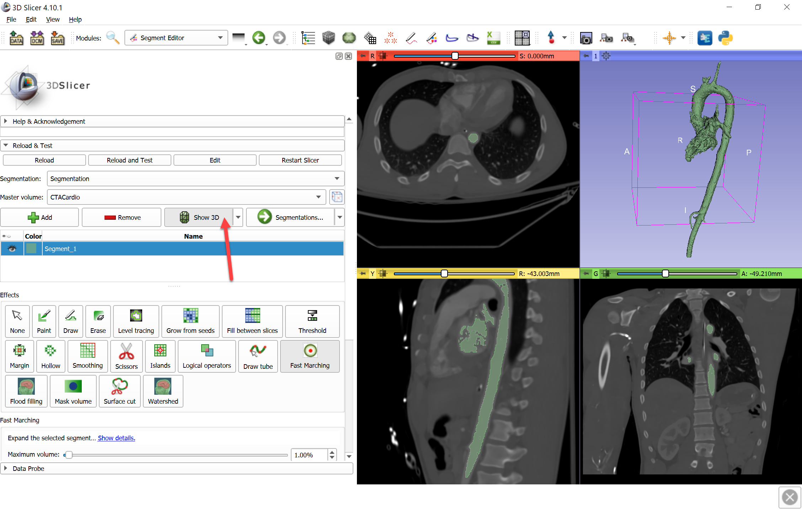
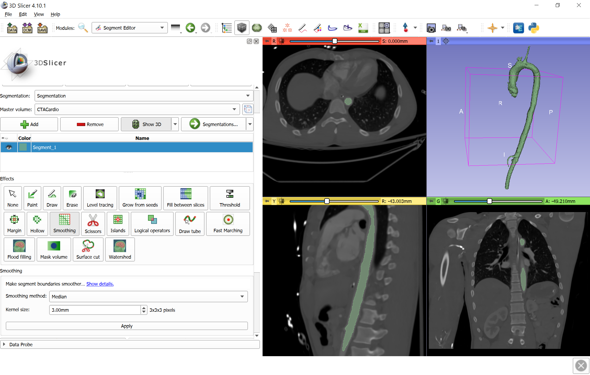
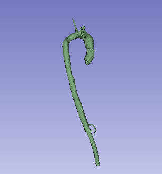

Overview
--------

- Task: Segment aorta on CT. This method produces results quickly, without requiring too much user input. The same method can be used for segmenting other structures that have a good contrast compared to the background but there are other structures with similar intensity nearby.
- Imaging modality: any

Prerequisites
-------------

- SegmentEditorExtraEffects extension is installed.
- Contrast-enhanced CT volume is loaded.

Recommended workflow
--------------------

- Click Paint effect and paint a few strokes inside the aorta.
- Click Fast Marching effect.
- Set `Maximum volume` to 1% (since volume of the aorta is very small compared to the total volume of the CT image).
- Click `Initialize` to compute segmentation preview.
- Adjust segment volume slider to achieve complete segmentation, but not too high value (to prevent leaking out of the aorta).
- Click `Apply` when segmentation preview is satisfactory to finalize the segmentation.
- Apply `Smoothing` effect, `Median` method to fill in missed voxels and smooth outer surface of the vessel.

Tips:
- If Fast Marching not visible then install SegmentEditorExtraEffects extension and restart the application
- To make paint strokes more visible, you can deactivate Paint effect and left-click-and-drag in the slice view to change background volume window/level.
- To see preview in 3D view: Click the down-arrow button on the right side of `Show 3D` button and disable `Surface smoothing` (this will make updates of 3D visualization very fast). Click `Show 3D` button.
- If a large piece of the aorta is missed then click `Cancel`, use Paint effect to paint inside the area that is missing, then re-initialize Fast Marching effect as described above.

Example
-------

- Download `CTACardio` sample data set
- Go to `Segment editor` module, click `Add` button to create a new segment
- Select `Paint` effect and paint a few strokes inside the aorta.

- Click Fast Marching effect
- Set `Maximum volume` to 1% (since volume of the aorta is very small compared to the total volume of the CT image)
- Click `Initialize` to compute segmentation preview.
- Adjust segment volume slider to achieve complete segmentation, but not too high value, to prevent leaking out of the aorta.

- To see preview in 3D view: Click the down-arrow button on the right side of `Show 3D` button and disable `Surface smoothing`, then click `Show 3D` button.

- Click `Apply` when segmentation preview is satisfactory.
- Apply `Smoothing` effect, `Median` method to fill in missed voxels and smooth outer surface of the vessel.

Final result:

