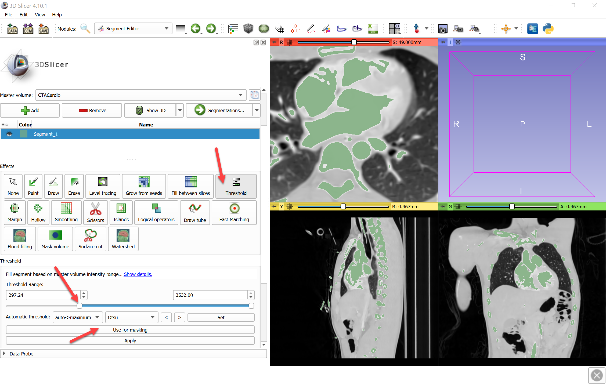
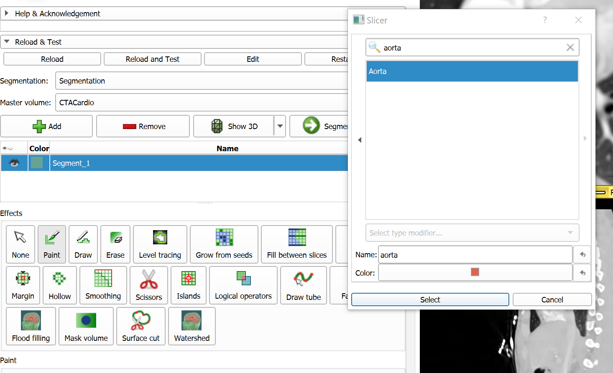
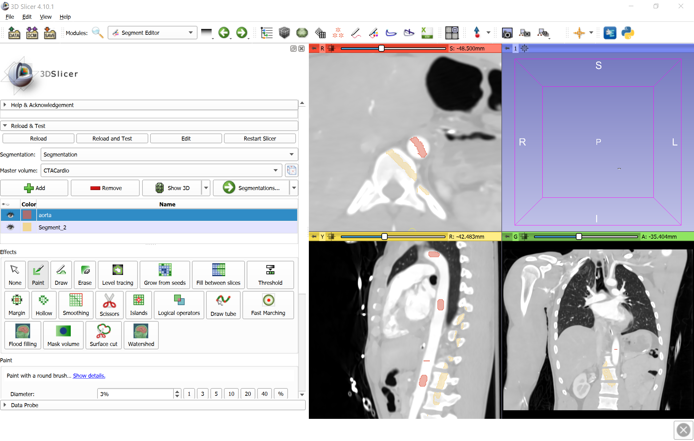
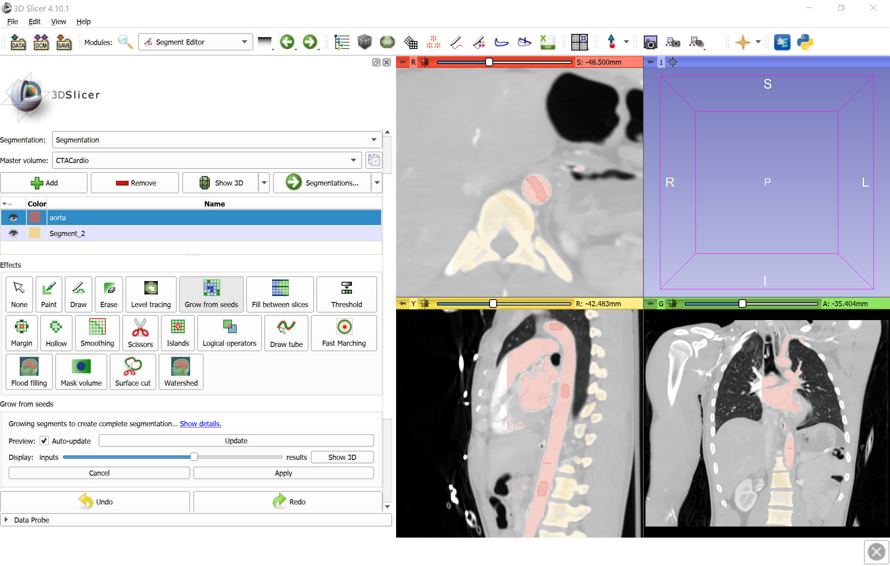
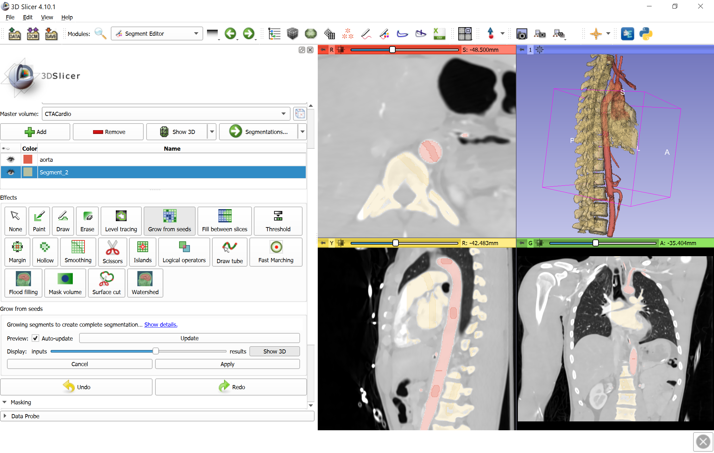
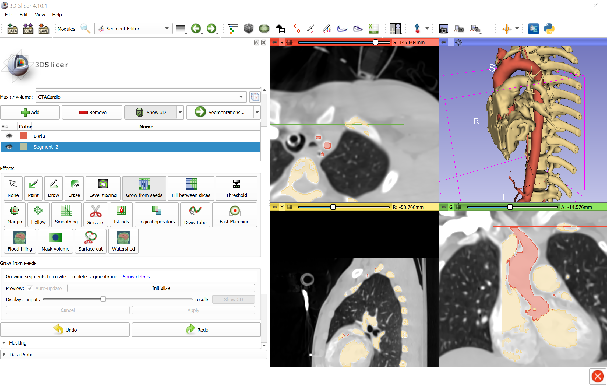
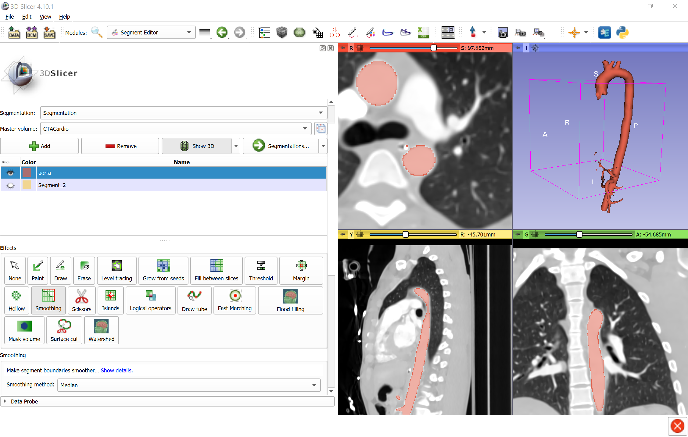
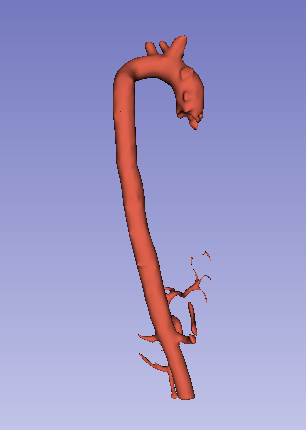

Overview
--------

- Task: Segment aorta on CT. This method can produce high-accuracy results - the more user inputs are provided, the more accurate the results will be. The same method can be used for segmenting other structures that have a good contrast compared to the background but there are other structures with similar intensity nearby.
- Imaging modality: any.

Prerequisites
-------------

- SegmentEditorExtraEffects extension is installed.
- Slicer-4.10 or later.

Recommended workflow
--------------------

- Create a segment for aorta and use Paint effect to paint a few strokes inside the aorta.
- Select Threshold effect, set slider to highlight the aorta, and click `Use for masking`.
- Create a segment for all other structures and paint in regions that have similar intensity as the aorta but it is not the aorta (bones, other vessels, etc.).
- Select `Grom from seeds` effect and click `Initialize` to compute segmentation preview.
- Inspect segmentation. If any region is misclassified then paint more strokes using the aorta or the other segment.
- Click `Apply` when segmentation preview is satisfactory to finalize the segmentation.
- Apply `Smoothing` effect, `Median` method to fill in missed voxels and smooth outer surface of the vessel.

Tips:
- To make paint strokes more visible, you can deactivate Paint effect and left-click-and-drag in the slice view to change background volume window/level.
- To see preview in 3D view: Click the down-arrow button on the right side of `Show 3D` button and disable `Surface smoothing` (this will make updates of 3D visualization very fast). Click `Show 3D` button.
- If a the segmentation does not extend to the entire aorta then paint strokes in the missing parts and reinitialize (click `Cancel` and then click `Initialize`).
- To quickly activate/deactivate `Paint` effect hit `1` key.
- To quickly switch between segments, effect hit `q` or `w` key.

Example
-------

- Download `CTACardio` sample data set
- Go to `Segment editor` module, click `Add` button to create a new segment
- Select Threshold effect, set slider to highlight the aorta, and click `Use for masking`.

- Double-click `Color` column to show segment terminology/color selector, typ `aorta`, then hit `Enter` (or click `Select`)

- Select `Paint` effect and paint a few strokes inside the aorta using aorta segment, and paint outside the aorta using the other segment. Regions painted with aorta segment will be included, regions painted with the other segment will be excluded from the final aorta segmentation.

- Click `Initialize` to compute segmentation preview.

- If a non-aorta region (e.g., ribs, heart, or other vessels) are shown in the preview as part of the aorta, then paint it over using the other segment. If part of aorta region is missed in the preview as part of the aorta, paint it over using the aorta segment.

- To see preview in 3D view: Click `Show 3D` button next to the `Display` inputs/outputs slider.

- Paint strokes using aorta and other segment as needed. Click `Apply` when segmentation preview is satisfactory.

- Apply `Smoothing` effect, `Median` method to fill in missed voxels and smooth outer surface of the vessel.

Final result:

