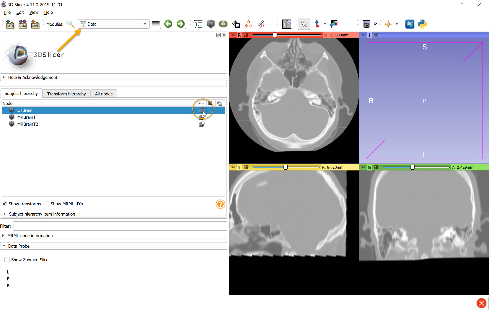
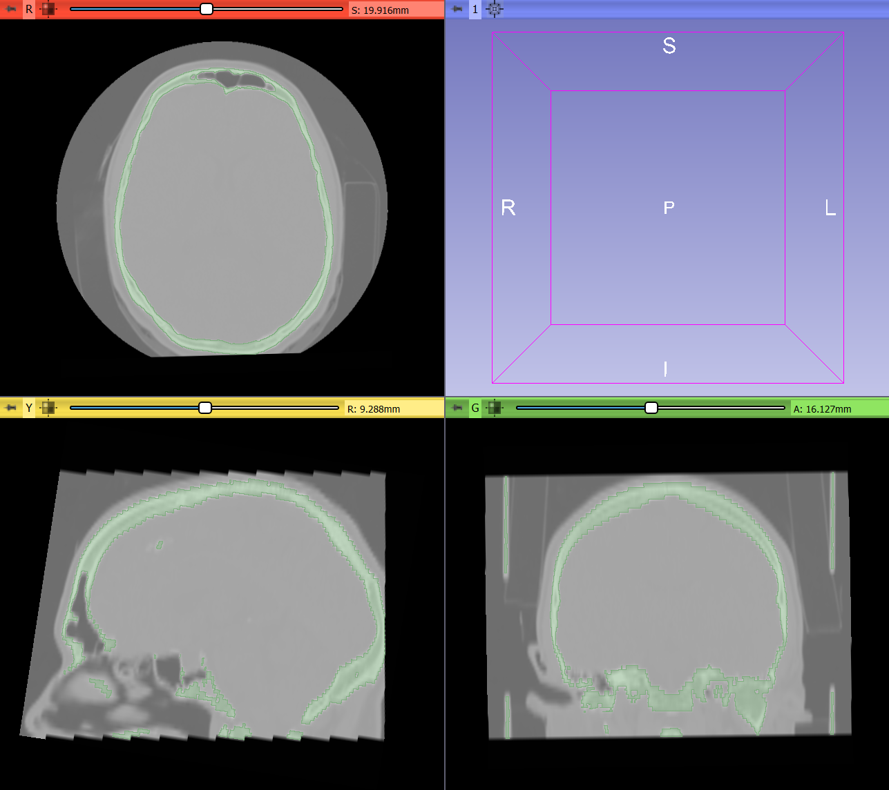
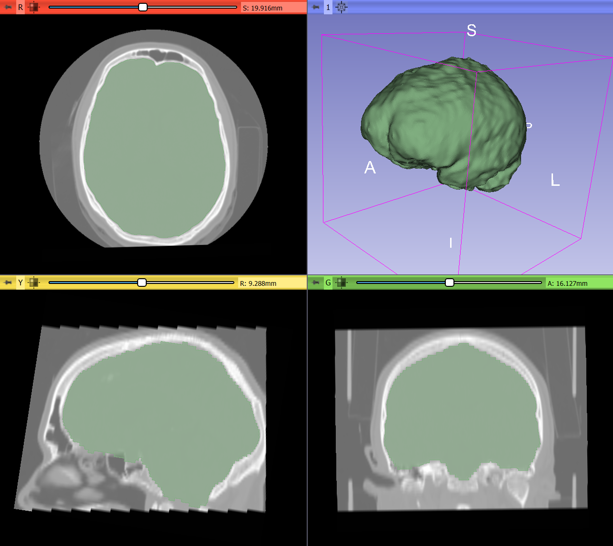
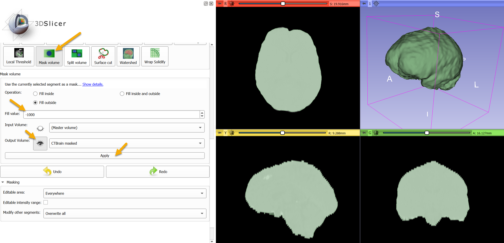
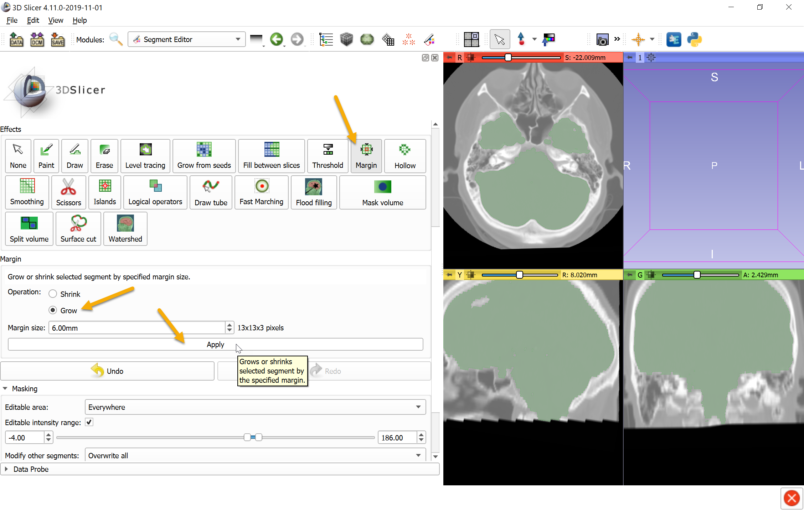
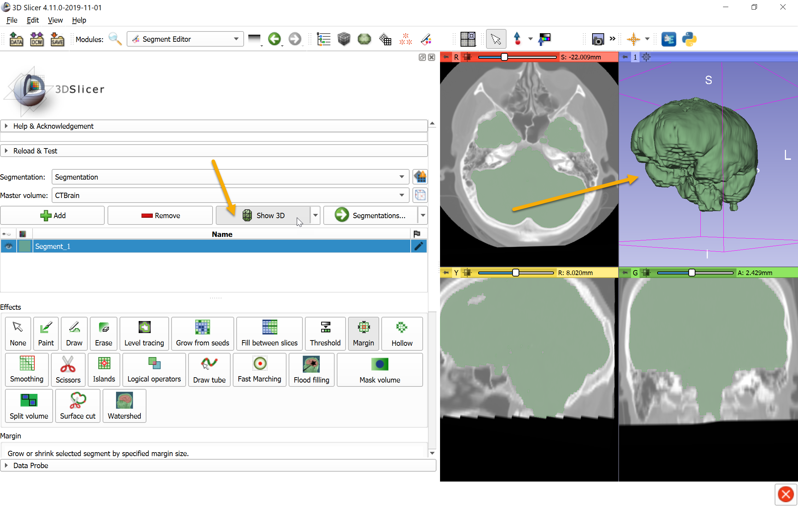

Overview
--------

- Task: Skull stripping - remove all skull and all other bone and soft tissues around the brain. Can be used whenever a fairly homogeneous region needs to be extracted from an image volume that is mostly surrounded by different intensity regions.
- Imaging modality: head CT.

Prerequisites
-------------

- SegmentEditorExtraEffects and SurfaceWrapSolidify extensions are installed.
- Head CT image is loaded.

Recommended workflow
--------------------

- Create a new segment that will contain the brain region
- Use `Threshold` effect to create a segment that contains the skull bone
- Use `Wrap solidify` effect (provided by `SurfaceWrapSolidify` extension) to extract the brain cavity.
- Use `Mask volume` effect (provided by `SegmentEditorExtraEffects` extension) to blank out all non-brain regions in the image.

Example
-------

- Go to `Sample Data` module and download `CT-MR Brain` sample data set. 2 MRI and 1 CT volumes are downloaded
- Go to `Data` module, click on eye icon of `CTBrain` item in Subject hierarchy tree to see the CT volume.

- Go to `Segment editor` module, click `Add` button to create a new segment
- Select `Threshold` effect and set intensity range of bone (from approximately 300 to maximum value), click `Apply`

- Remove small speckles of noise using `Islands` effect: choose `Keep largest island` option and click `Apply`

- Select `Wrap solidify effect`, set region to `Largest cavity`
- Enable `Split cavities` and set cavity size slider to approximately 30mm to prevent the segmentation from "leaking" into other soft-tissue regions through small discontinuities in the bone
- Click `Apply`

- Select `Mask volume` effect, set `Fill value` to -1000 (corresponding to air on CT), and click `Apply` to create a new volume where non-brain region is blanked out. To see the resulting masked volume, click the eye icon next to `Output volume`.

- Brain image intensity range is very narrow range compared to whole intensity range of the volume. To see brain contrast better, go to `Data` module, click eye icon of `Segmentation` node to hide it, click on eye icon of `CTBrain masked` node to show it in slice viewers.

- Click "adjust window/level..." toolbar and then hold down `Ctrl` key while click-and-drag in the brain region to set optimal window/level.

Final result:

