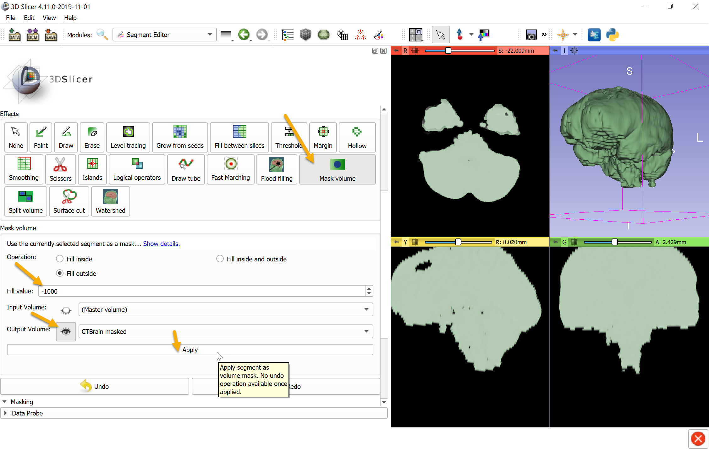
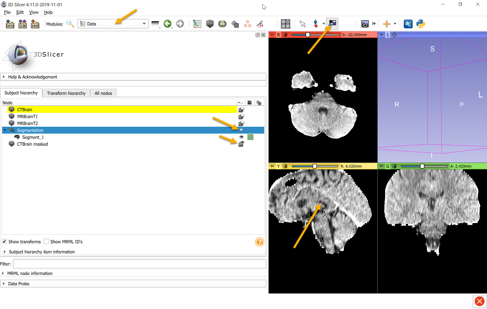

Overview
--------

- Task: Skull stripping - remove all skull and all other bone and soft tissues around the brain. Can be used whenever a fairly homogeneous region needs to be extracted from an image volume that is mostly surrounded by different intensity regions.
- Imaging modality: head CT.

Prerequisites
-------------

- SegmentEditorExtraEffects extension is installed.
- Head CT image is loaded.

Recommended workflow
--------------------

- Create a new segment that will contain the brain region
- use `Threshold` effect to select the brain region. Soft tissues with similar image intensity as the brain will be selected, too, but they will be removed by the next 3 processing steps.
- Use `Margin` effect with `Shrink` operation to disconnect brain region from similar-intensity soft tissue regions.
- Use `Islands` effect's `Keep selected island` operation to keep only brain region.
- Use `Margin` effect with `Grow` operation to restore brain region original size.
- Use `Mask volume` effect to blank out all non-brain regions in the image.

Example
-------

- Go to `Sample Data` module and download `CT-MR Brain` sample data set. 2 MRI and 1 CT volumes are downloaded
- Go to `Data` module, click on eye icon of `CTBrain` item in Subject hierarchy tree to see the CT volume.

- Go to `Segment editor` module, click `Add` button to create a new segment
- Select `Threshold` effect and set brain intensity range by clicking on `Local histogram` section title then click-and-dragging in the brain in yellow (sagittal) view. Click Apply to save previewed region.

- Select `Margin` effect, set operation to `Shrink`, margin size to 6mm, and click `Apply` to make sure the brain region is not connected anymore to any other regions. Depending on the data set, slightly smaller margin value could be enough, or larger value may be necessary.

- Select `Islands` effect, choose `Keep selected island` operation, then click anywhere within the brain region in a slice view to keep only the brain region and remove all other disconnected soft tissue regions.

- Select `Margin` effect, set operation to `Grow`, keep the margin size the same as before, and click `Apply`. This restores the original brain segment size.

- Click `Show 3D` button to see the brain shape in 3D view. If non-brain regions appear then either remove them using `Scissors` effect or click `Undo` a few times and shrink the brain segment a bit larger margin size.

- Select `Mask volume` effect, set `Fill value` to -1000 (corresponding to air on CT), and click `Apply` to create a new volume where non-brain region is blanked out. To see the resulting masked volume, click the eye icon next to `Output volume`.

- Click `Add` button to create a new segment, which will store the part that is separated from the skull

- Brain image intensity range is very narrow range compared to whole intensity range of the volume. To see brain contrast better, go to `Data` module, click eye icon of `Segmentation` node to hide it, click on eye icon of `CTBrain masked` node to show it in slice viewers.

- Click "adjust window/level..." toolbar and then hold down `Ctrl` key while click-and-drag in the brain region to set optimal window/level.

Final result:

