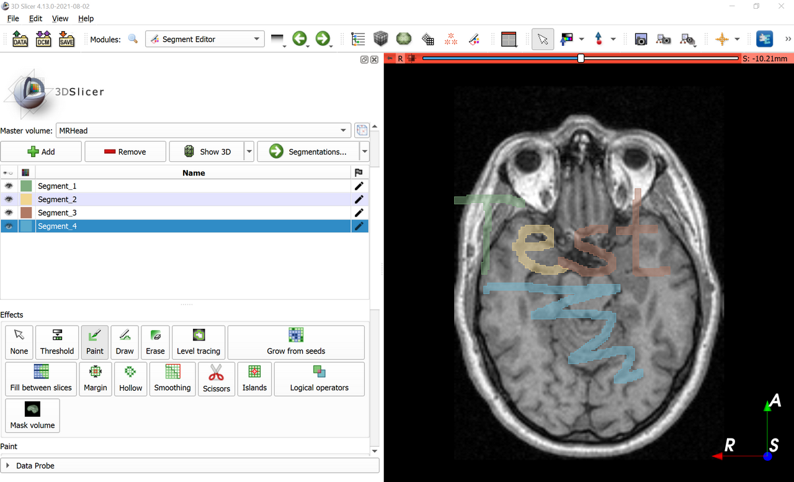
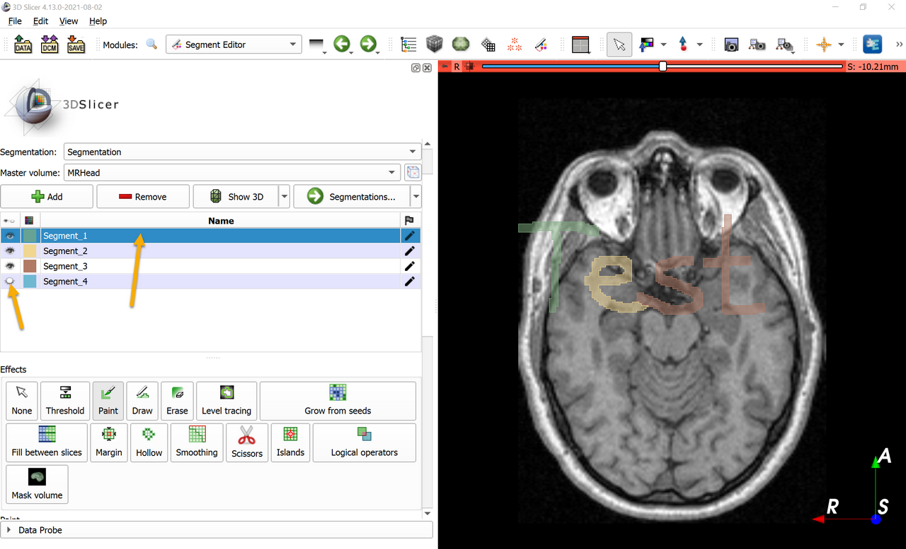
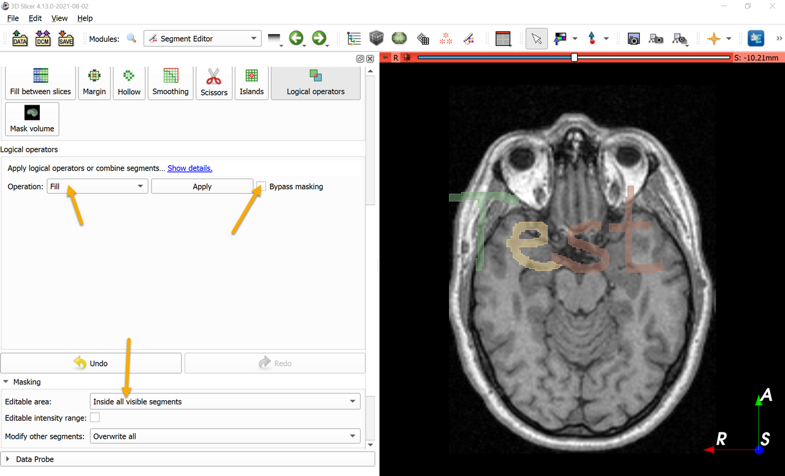
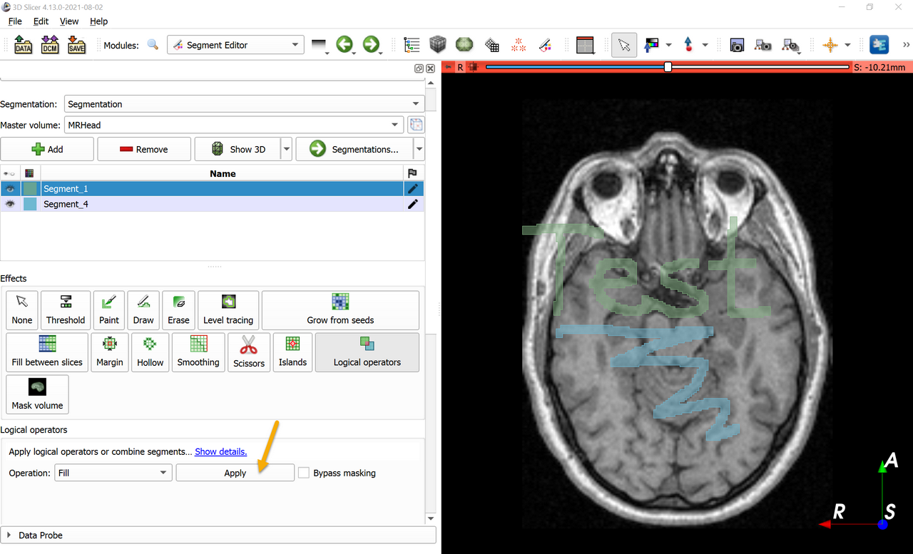

Overview
--------

- Task: Merge selected segments into one segment.
- Imaging modality: any

Prerequisites
-------------

- Have a segmentation with multiple segments.

Recommended workflow
--------------------

Merge two segments:

- Select the first segment to be merged.
- Click `Logical operators` effect.
- Set `Operation` to `Add`.
- Select the second segment to be merged in the `Add segment` list.
- Click `Apply`.

Merge multiple segments:

- Select the segment that will contain the merged segments.
- Make visible the selected segment and all the segments that you want to merge and hide all other segments.
- Click `Logical operators` effect.
- In `Masking` section (near the bottom), set `Editable area` to `Inside all visible segments`.
- In logical operators effect options: uncheck `Bypass masking` and set `Operation` to `Fill`.
- Click `Apply`.

Example
-------

Merge Segment_1, Segment_2, Segment_3 into one segment (Segment_1), while leaving Segment_4 as a separate segment.

- Download `MRHead` sample data set
- Go to `Segment editor` module, click `Add` button 4x to create 4 new segments.
- Select `Paint` effect and paint a few strokes into each segment.

- Hide Segment_4 to exclude it from merging.
- Select Segment_1 to designate it as the segment that will store the merging result.

- Click `Logical operators` effect. In `Masking` section (near the bottom), set `Editable area` to `Inside all visible segments`, uncheck `Bypass masking`, set `Operation` to `Fill`.

- Click `Apply` to merge the segments.
- Segment_2 and Segment_3 can now be deleted (they are overwritten by Segment_1 anyway because in `Masking` section `Modify ether segments` was set to `Overwrite all`)
- Segment_4 can be shown again.

