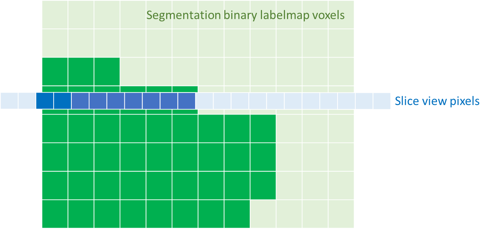
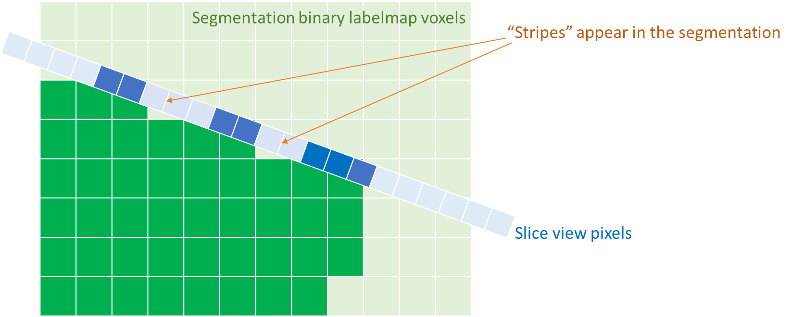
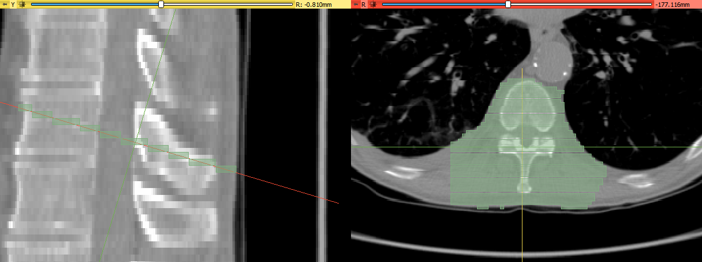
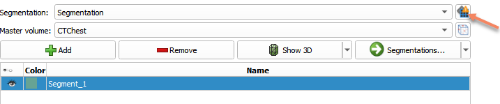
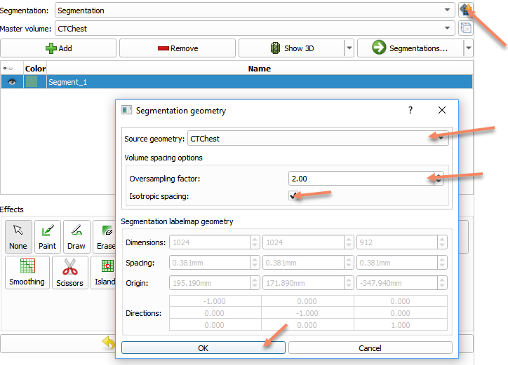
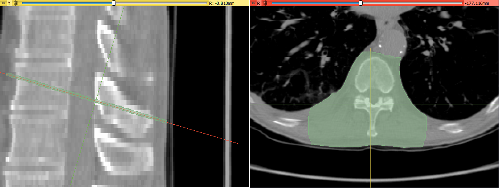
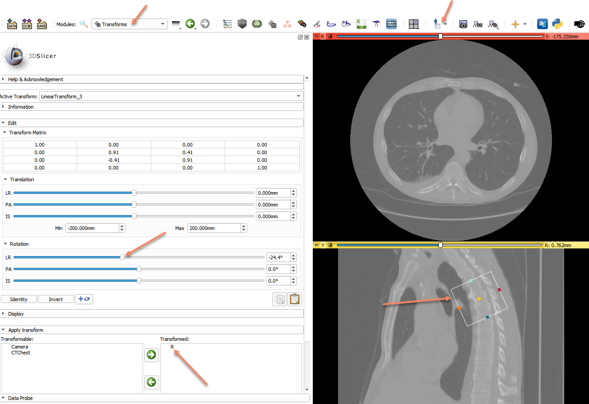
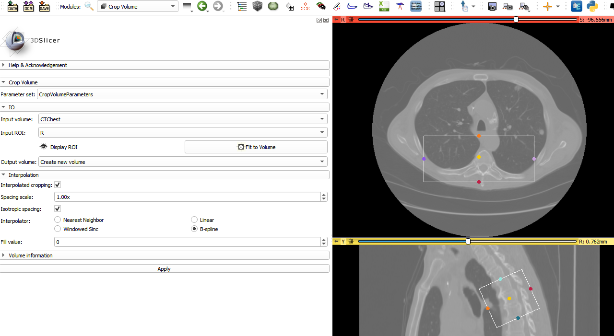
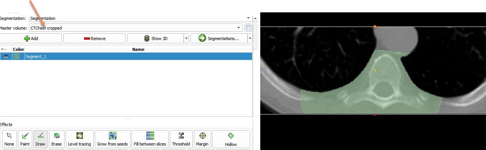

Overview
--------

- Task: Segment image on slices that are not aligned with axes of the master volume.
- Imaging modality: any 3D imaging modality (CT, MRI, ...)

Segment Editor allows editing of segmentation on slices of arbitrary orientation. However, since edited segments are stored as binary labelmaps, "striping" artifacts may appear on thin segments or near boundary of any segments.

When slice view axes are aligned with segment axes: segment boundaries may appear "blocky" in slice views, but no other artifacts appear.

When slice view axes are not aligned with segment axes: slice view is filled from voxels of several planes of the segmentation, therefore the thin objects or boundary of a solid object may appear to have a striped pattern.

Slicer notifies the user if slice view axes are not aligned with segment axes by showing a warning icon in the Segment Editor, next to the segmentation node selector. If the warning button is clicked, each slice view is automatically aligned to the closest segment axis.

Recommended workflow
--------------------

Depending on what is the end goal, there are several approaches to deal with stripe artifacts.

### Option A. Ignore stripes

Stripe artifacts can be safely ignored. Correctness of the segmentation near object boundaries can be verified by enabling slice view intersections and reviewing multiple neighboring slices.

Probability of seeing stripe artifacts can be greatly reduced by making the segmentation resolution finer. This can be achieved by oversampling the segmentation.

### Option B. Create resampled volume with rotated axes

- Define a region of interest (ROI) by selecting ROI from the dropdown menu of the place button on toolbar.
- Apply rotation transform to the ROI and adjust rotation sliders (or use any precomputed transforms, such as inverse of volume's AC-PC transform)

- Use `Crop volume` module to crop the volume with the ROI

- Use the cropped volume as Master volume in the Segment Editor

