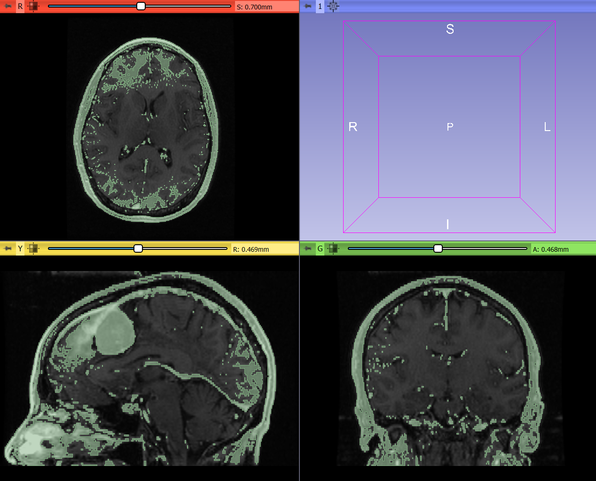
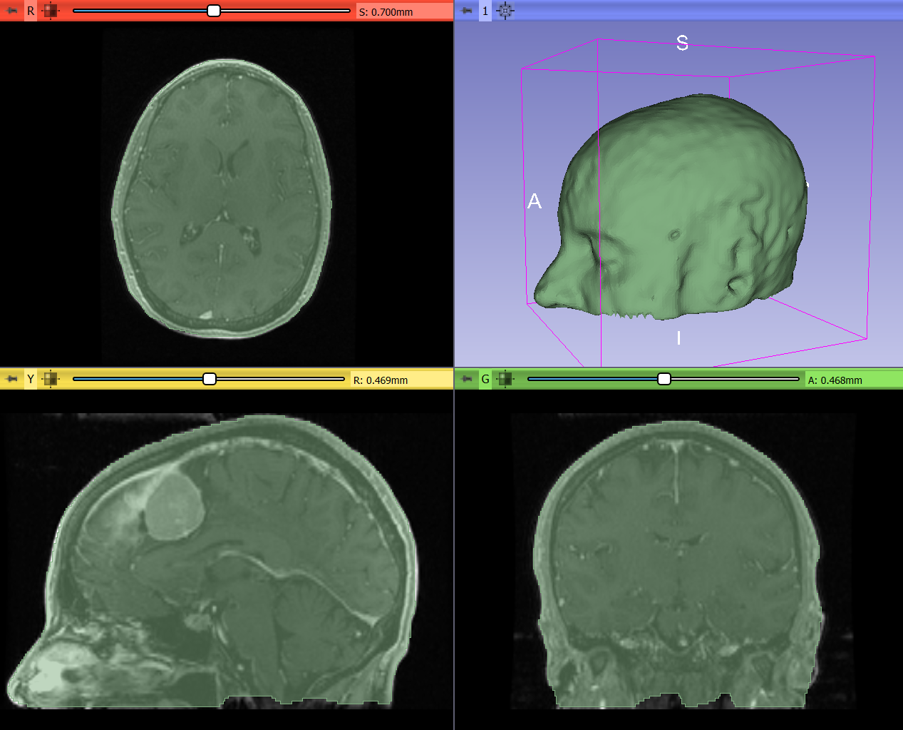
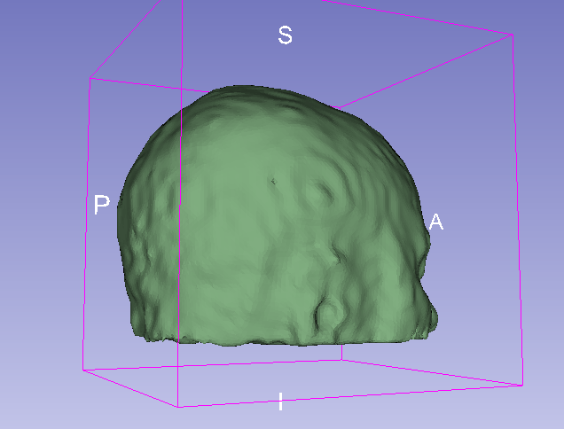

Overview
--------

- Task: Extract skin surface without holes inside the segment. Important for 3D printing or surface-based registration.
- Imaging modality: CT, MRI

Usually there is strong contrast between tissue and air, therefore segmenting the skin surface should be easy, except there may be air inside body part or some tissues or fluids may have image intensity similar to air. Therefore, simple global thresholding may not always work.

This recipe replaces an [earlier recipe that used `Flood filling` effect](../SkinSurface/README.md). This new recipe is much simpler and provides comparable or better results.

Recommended workflow
--------------------

- Use `Wrap solidify` effect (provided by `SegmentEditorExtraEffects` extension) with to segment outside air. Click anywhere in the outside air in slice views to segment the air. If not all areas are hightlighted then click in air regions that are not included and/or increase `Intensity tolerance` parameter. If segment leaks inside the tissue then click `Undo` and increase `Neighborhood size`.
- Use `Logical operators` effect / `Invert` operation to make the segment contain tissue instead of air
- Use `Scissors` effect and `Smoothing` effect to remove artifacts and noise

Example
-------

- Download `MRBrainTumor1` sample data set

- Go to `Segment editor` module, create a new segment

- Select `Threshold effect` effect, set range from about 110 to maximum (this selects skin surface and structures inside the head), then click Apply

- Remove small speckles of noise using `Islands` effect: choose `Keep largest island` option and click `Apply`

- Select `Wrap solidify effect`, leave region at default value (`Outer surface`)

- Reduce `Oversampling` value to 0.8x in `Advanced`section for faster computation and smoother surface (optional)

- Click `Apply`

Final result:

