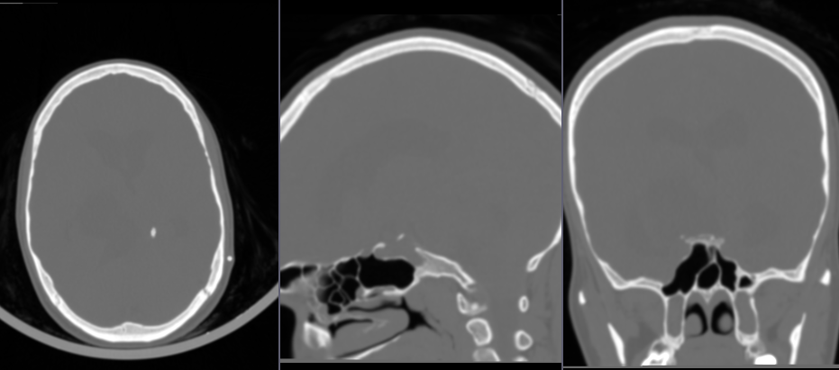
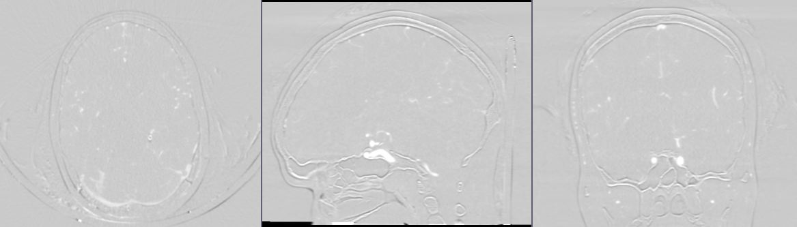
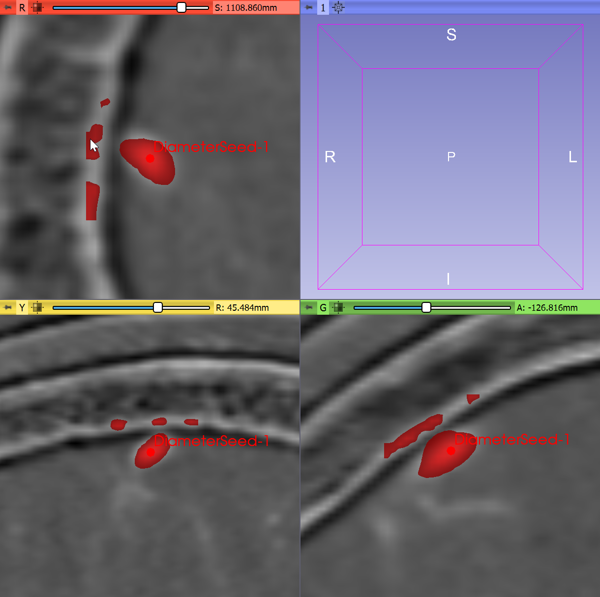
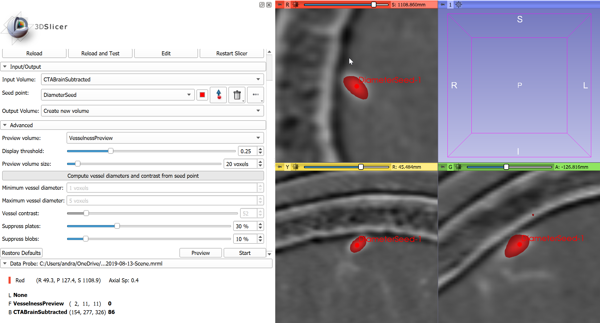
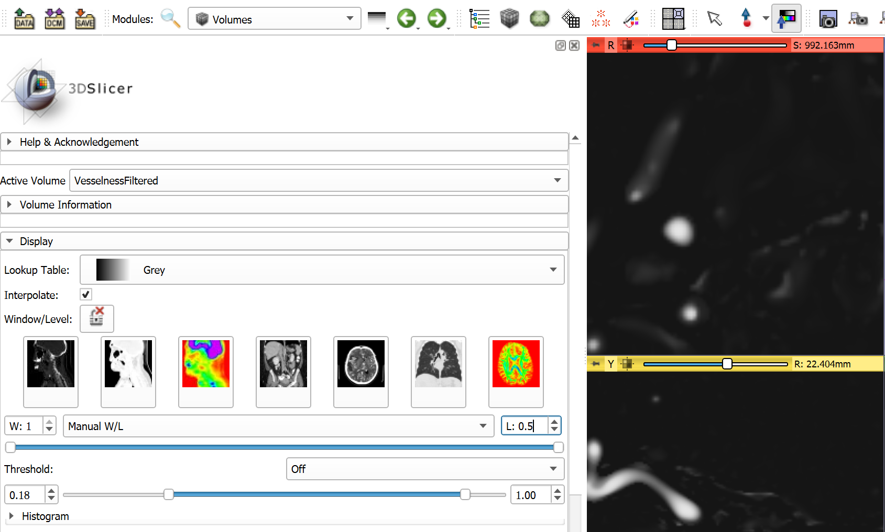
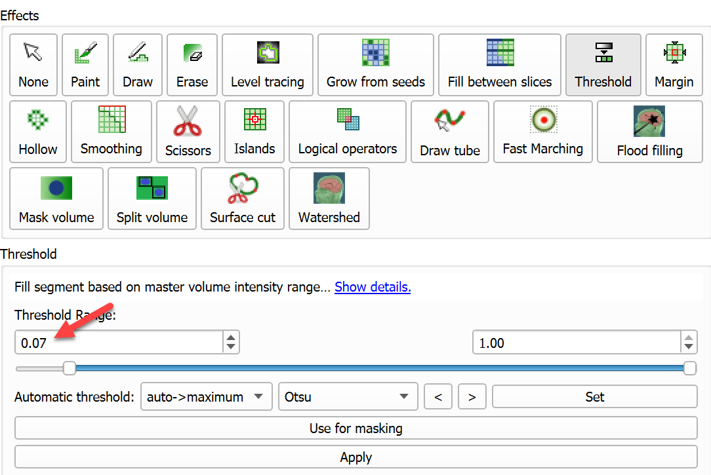
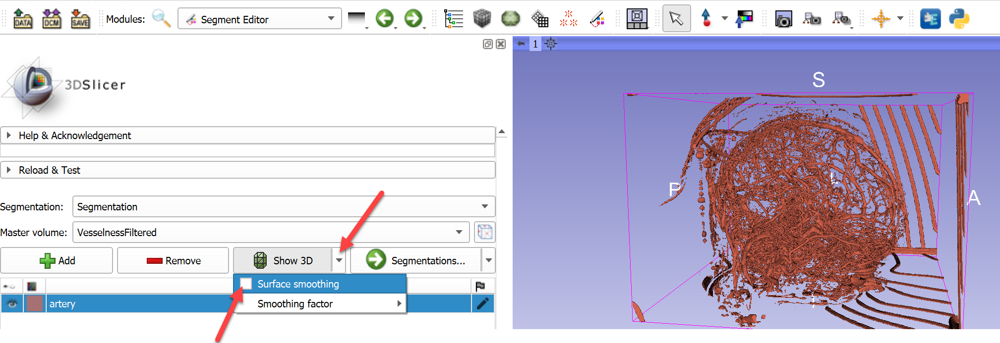
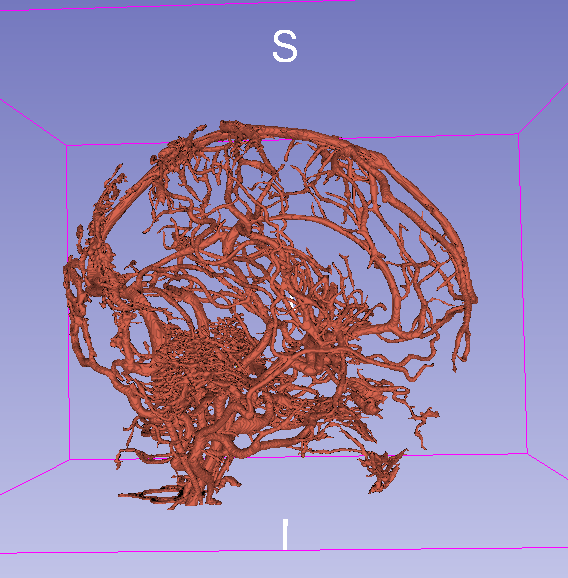
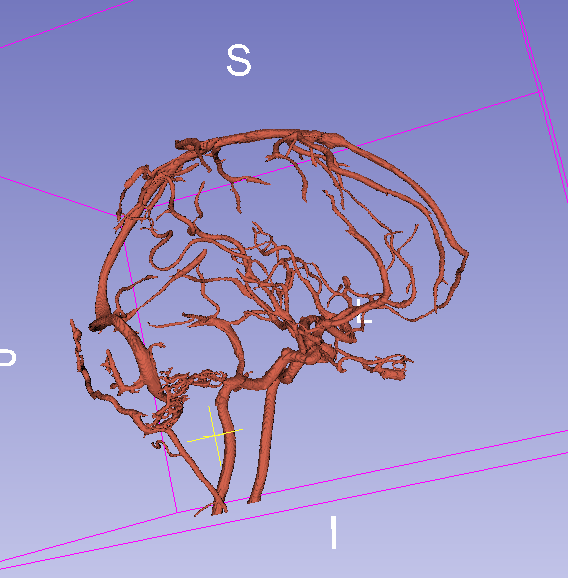

Overview
--------

- Task: Segment cerebral vasculature on contrast-enhanced CT by background subtraction.
- Imaging modality: any, with baseline (non-contrasted) and contrasted images available.

Prerequisites
-------------

- SlicerElastix and SlicerVMTK extensions are installed.
- Slicer-4.10 or later.

Recommended workflow
--------------------

- Align baseline (non-contrast) CT and contrast-enhanced CT using `General registration (Elastix)` module to minimize artifacts due to patient motion.
- Subtract the baseline volume from contrast-enhanced volume using `Subtract scalar volumes` module.
- Use `Vesselness filtering` module to remove non-vessel shaped structures (bone plates that have not been fully suppressed by subtraction).
- In `Segment editor` module, use vesselness filtered image as master volume and extract vessels using `Threshold` effect.
- Remove remaining artifacts using `Islands` effect's `Keep largest island` method.
- Optionally compute vessel centerline using `Centerline extraction` module.

Tips:
- If there is only rigid patient motion between baseline and contrast images then `generic rigid (all)` registration preset may be used, which attempts to align the images by applying rigid transform. It may be more robust and faster than using a warping transform.
- Find a module by hitting Ctrl + F and start typing its name
- Adjust window/level of the image to improve visibility of vessels in slice viewers: click Window/Level mouse mode in the toolbar and Ctrl + Left-click-and-drag with the mouse (starting from a vessel point) to set optimal window/level automatically.

Example
-------

- Load `CTABrainBaseline` and `CTABrainContrast` volumes (get the images using the links below). Significant patient motion is visible. To minimize artifacts, we need to align the images before subtraction.
  - CTABrainBaseline: download from [here](https://github.com/Slicer/SlicerDataStore/releases/download/SHA256/dd3922fb4babe47c49d57674936aac93342296ee3551d2af5b2a9a3b7af916b1) and rename the file to `CTABrainBaseline.nrrd`
  - CTABrainContrast: download from [here](https://github.com/Slicer/SlicerDataStore/releases/download/SHA256/7b8fccab033eac291a4b237b4f99248f337ac6be0c4c8bf87d4f4d75f66214d3) and rename the file to `CTABrainContrast.nrrd`

- Go to `General registration (Elastix)` module
- For `Fixed volume` choose baseline (no-contrast) volume
- For `Moving volume` choose contrast volume as 
- For `Preset` choose `generic (all)`
- For `Output volume`, choose `Create new Volume as...` and type `CTABrainContastAligned`
- Click `Apply` and wait until the registration completes (it may take several minutes)

- Go to `Subtract scalar volumes` module to subtract baseline image from contrast image
- For `Input volume 1` choose `CTABrainContrastAligned`
- For `Input volume 2` choose `CTABrainBaseline`
- For `Output volume`, choose `Create new Volume as...` and type `CTABrainSubtracted`
- Click `Apply`

- Go to `Vesselness filtering` module
- For `Input volume` choose `CTABrainSubtracted`
- For `Seed point` choose `Create new MarkupsFiducial` and click in a vessel point in the image. Tip: Choose a point that is not trivial to segment, for example one that is near bone surfaces that are not fully suppressed by the subtraction.
- Click `Preview`, wait for the filter preview to complete.

- Zoom out the slice views and inspect the results: some parts of the bone is detected as vessel. Increase suppression of plate-like structures by opening `Advanced` section and increasing `Suppress plates` value to 35% (other values that are used in this example: `Minimum vessel diameter` = 1 voxels, `Maximum vessel diameter` = 5 voxels, `Vessel contrast` = 52, `Suppress blobs` = 10%).

- Optional: Check filtering results at a few different locations by deleting current point, then placing a new point in the slice viewer (click the trashcan icon next to `Seed point`, click the arrow button next to it, and click in the image). Click `Preview` button to see filtering results.
- Click `Start` to perform vesselness filtering on the entire image. The operation may take a few minutes.

- Optional: Adjust visualization of vesselness image in Volumes module. Set window (`W`) value to 1.0, set level (`L`) value to 0.5. Set `Threshold` to `Off`.

- Go to `Segment editor` module.
- Click `Add` button to create a new segment.
- Double-click on the green rectangle in the `Color` column, start typing `Artery` and hit `Enter` to accept the proposed name and color.
- Select Threshold effect, set lower threshold value to 0.7 - to show the relevant vessels but still keep amount of artifacts under control. Click `Apply`.

- Visualize the results in 3D: Uncheck `Surface smoothing` in dropdown menu of `Show 3D` button to make 3D display update faster and prevent shrinking of vessels. Then click `Show 3D button` to see the vessels in the 3D view.

- To remove disconnected, non-vascular structures, click `Islands` effect, use the default `Keep largest island` option, and click `Apply`.

Final result with threshold = 0.07:

Final result with threshold = 0.15:

